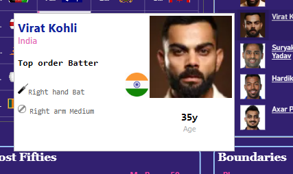
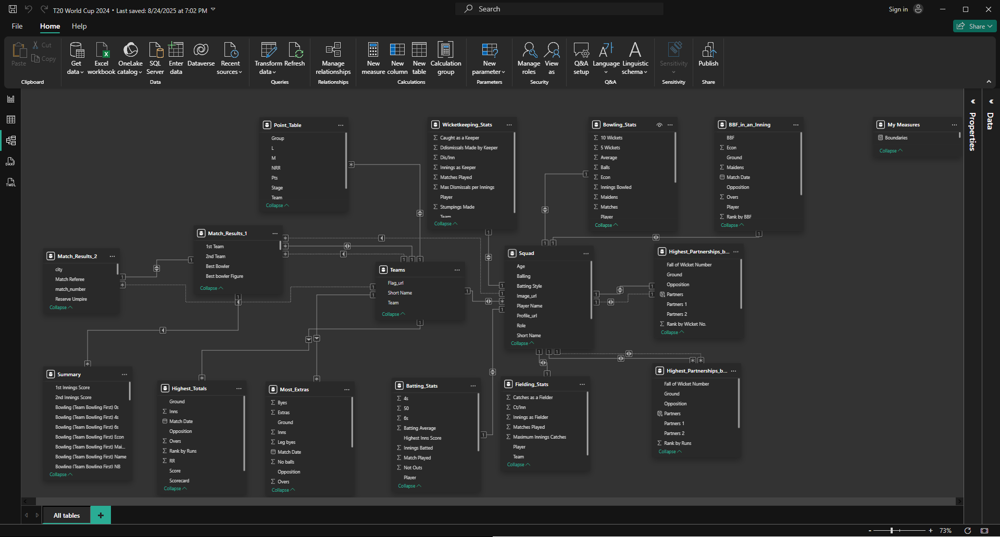

# 🏏 T20 World Cup 2024 Power BI Dashboard  

   
  

This repository contains a **Power BI dashboard** built to analyze and visualize statistics from the **ICC Men’s T20 World Cup 2024**. The dashboard highlights batting, bowling, fielding, team, and match records, allowing interactive exploration of tournament data.  

---

## 📂 Repository Contents  

- `T20 World Cup 2024.pdf` → PDF version of the Power BI dashboard   
- Power BI `.pbix` file
- Data Sources → excel & csv
- Screenshots of Tooltip page & Data  Modeling

---

## 📊 Dashboard Features  

- **Batting Records**: Runs, averages, strike rates, boundaries, fifties, and highest scores.  
- **Bowling Records**: Wickets, economy rates, five-wicket hauls, and best bowling figures.  
- **Fielding & Keeping**: Catches, dismissals, stumping stats.  
- **Partnerships & Team Records**: Highest partnerships, most extras, largest victories.  
- **Tournament Standing**: Group stage and Super Eight points table.  
- **Match Summary**: Match-by-match results with top performers.  

---

## 🔗 Tooltips  

A **custom tooltip page** was designed to display detailed player information, including:  
- Profile image  
- Player role  
- Batting and bowling style  
- Country flag and team  
- Quick stats  

**Example Tooltip:**  

  

---

## 🗂️ Data Modeling  

The report uses a **star-schema style model**, integrating multiple cricket datasets. Relationships were built around **Teams**, **Squads**, and **Matches** to enable flexible filtering across all visuals.  

**Key Tables**:  
- `Teams` – Team details (name, flag, abbreviation)  
- `Squad` – Player profiles (name, role, batting/bowling style, image URL)  
- `Match_Results` – Match outcomes, referees, umpires  
- `Batting_Stats` – Runs, averages, strike rates, fifties  
- `Bowling_Stats` – Wickets, overs, economy, maidens  
- `Fielding_Stats` – Catches, dismissals, maximum per innings  
- `Point_Table` – Group stage and Super Eights standings  
- `Highest_Totals` / `Most_Extras` – Team-based records  
- `Highest_Partnerships` – Runs by partnership and wicket  

**Data Model Screenshot:**  

  

---

## 📄 PDF Preview  

A PDF export of the full dashboard is included for offline viewing:  
📑 [View Dashboard PDF](T20%20World%20Cup%202024.pdf)  

---

## ⚙️ Tools & Technologies  

- **Microsoft Power BI** – Data modeling and visualization  
- **Power Query** – Data transformation  
- **DAX** – Custom measures and calculations  
- **ESPN Cricinfo** – Data source (player stats, match details)  

---

## 🚀 How to Use  

1. Clone the repository  
   ```bash
   git clone https://github.com/your-username/T20-World-Cup-2024-Dashboard.git
   ```  
2. Open the `.pbix` file in Power BI Desktop  
3. Explore the interactive visuals and tooltip pages  

---

## 📌 Notes  

- Player profile images and info are linked via ESPN Cricinfo URLs.  
- Data is structured for the **2024 tournament** and can be extended for future ICC events.  
